# AWS IoTで温度データ収集の検証手順
## 概要

[Raspberry Pi 3 Model B](https://www.raspberrypi.org/products/raspberry-pi-3-model-b/) (以下RaspberryPiと称する)に温度センサーを取り付け、取得された温度データを[AWS IoT Device SDK for Python](https://github.com/aws/aws-iot-device-sdk-python)を利用し、AWS IoTへ送信する。送信された温度データをElasticsearchで蓄積し、Kibanaで統計結果を確認する。

## RaspberryPiに温度センサーを取り付ける

### 配線

下図に示すように温度センサー[DA18B20](https://www.maximintegrated.com/jp/products/analog/sensors-and-sensor-interface/DS18B20.html)の３本の足をRaspberryPiにつなぐ。
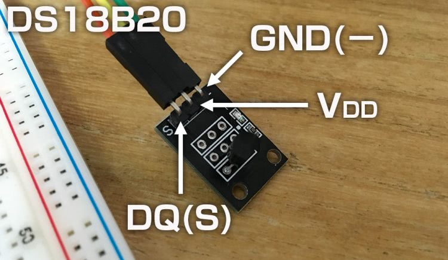
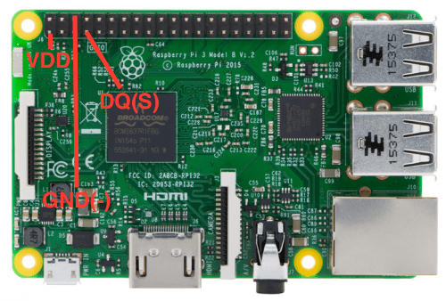

### /boot/config.txtの編集

/boot/config.txtの最後`dtoverlay=w1-gpio,gpiopin=4,pullup=y`を追加する。
```
sudo sh -c 'echo "dtoverlay=w1-gpio,gpiopin=4,pullup=y" >> /boot/config.txt'
```
### カーネルモジュールをロードする

1-wire用下記モジュールをロードし、RaspberryPiを再起動する。
```
$ sudo modprobe w1-gpio \
    && sudo modprobe w1-therm \
    && sudo reboot
```

### 温度センサーが正常に動作していることを確認する

```
$ cat /sys/bus/w1/devices/28-*/w1_slave
a1 01 4b 46 7f ff 0c 10 8c : crc=8c YES
a1 01 4b 46 7f ff 0c 10 8c t=26062
```
上記ファイルの２行目のtの1000分の1は摂氏温度である。

## AWS IoTへ接続の準備

主な流れは下記の通り
- AWSアカウント作成
- IoTにデバイス(RaspberryPi)の登録、証明書等の発行
- RaspberryPiからの送信、及びサーバ側の受信を確認する
### AWSアカウントの作成
  1. [AWS](https://aws.amazon.co.jp)からアカウントを作成する。

    詳細手順は省略

  2. AWS管理者からIAMユーザとアクセスキーペアを作成する。
    AWS管理者で下記処理を実施する。
    - アクセスポリシーを作成する
      ```
    $ aws iam create-policy \
        --policy-name iotDevPolicy \
        --policy-document file://path/to/iam-dev-policy.json
    ```
    - 作業用ユーザーを作成する
    ```
    $ aws iam create-user --user-name iotDeveloper
    ```
    - ユーザーにポリシーをアタッチする
    ```
    $ aws iam attach-user-policy \
          --user-name iotDeveloper \
          --policy-arn "arn:aws:iam::011960800664:policy/iotDevPolicy"
    ```
    - AWSCLI用アクセスキーを生成する。出力されたアクセスキーと秘密キーを控えておく。
    ```
    aws iam create-access-key --user-name iotDeveloper
    ```

### IoTにデバイス(RaspberryPi)の登録、証明書等の発行

1. AWSCLIのインストール
```
$ pip install awscli --upgrade --user
```
AWSCLIの初期設定
```
$ aws configure
AWS Access Key ID [None]: [先控えたiotDeveloperの秘密キー]
AWS Secret Access Key [None]: [先控えたiotDeveloperの秘密キー]
Default region name [None]: ap-northeast-1
Default output format [None]: json
```
2. デバイスを登録

  - デバイスを登録
  ```
    $ aws iot create-thing --thing-name raspberry01
  ```
  - デバイスの証明書を作成
  ```
  $ mkdir certs
  $ cd certs
  $ aws iot create-keys-and-certificate --set-as-active \
        --certificate-pem-outfile cert.pem \
        --public-key-outfile public.key \
        --private-key-outfile private.key
  {
      "certificateArn": "arn:aws:iot:ap-northeast-1:011960800664:cert/d03e8b1c52bdf612a2d6bf4b1c33e3cec6dde2aec591af1135167adb4ffe6c7d",
      "certificatePem": [デバイス証明書],
      "keyPair": {
          "PublicKey": [公開キー],
          "PrivateKey": [プライベートキー]
      },
      "certificateId": "d03e8b1c52bdf612a2d6bf4b1c33e3cec6dde2aec591af1135167adb4ffe6c7d"
  }
  ```
  AWS IoT ルート証明書を取得する
  ```
  curl https://www.symantec.com/content/en/us/enterprise/verisign/roots/VeriSign-Class%203-Public-Primary-Certification-Authority-G5.pem \
      -o root.pem
  ```
  作成された証明書ファイルを確認する。
  ```
  $ ls
  cert.pem	private.key	public.key	root.pem
  ```
  - デバイスポリシーを作成
  ```
  $ aws iot create-policy \
      --policy-name RaspberryPolicy \
      --policy-document file://path/to/policy.json
  ```
  - デバイスとポリシーを証明書へアタッチする
  ```
  # ポリシーをアタッチする
  $ aws iot attach-policy \
      --policy-name RaspberryPolicy \
      --target "arn:aws:iot:ap-northeast-1:011960800664:cert/d03e8b1c52bdf612a2d6bf4b1c33e3cec6dde2aec591af1135167adb4ffe6c7d"
  # デバイスをアタッチする
  $ aws iot attach-thing-principal \
      --thing-name raspberry01 \
      --principal "arn:aws:iot:ap-northeast-1:011960800664:cert/d03e8b1c52bdf612a2d6bf4b1c33e3cec6dde2aec591af1135167adb4ffe6c7d"
  ```

## RaspberryPiからの送信、及びサーバ側の受信を確認する
  - 作成された証明書と温度送信プログラムをRaspberryPiへ転送

  ```
  $ scp certs/cert.pem \
        certs/private.key \
        certs/root.pem \
        raspberryPi/sendTemp.py \
        pi@192.168.145.193:/home/pi/iotClient/
  ```

  - RaspberryPiにAWS IoT Device SDK for Pythonをインストールする

  ```
  $ pip install AWSIoTPythonSDK
  ```

  - AWS IoT Device SDK for Pythonのサンプルを基づいた温度データ送信プログラムを起動して送信する。

  ```
  $ python sendTemp.py
  ```
  正常の場合、一秒ごと温度を取得し、AWS IoTへ送信する。送信する際に、下記メッセージが出力される。

  ```
  Published topic /thermometer/thermometer01: {"temperature": 25.875}
  ```

  - AWS IoTでの受信確認

    AWSコンソールを開いて、「サービス」→「AWS IoT」→「テスト」を選択し、サブスクリプションのテスト画面を開く。
    トピックは`/thermometer/thermometer01`で送信されるため、「トピックのサブスクリプション」に`/thermometer/thermometer01`を入力して、「トピックへのサブスクライブ」をクリックする。
    
    受信したメッセージが画面に表示される。
    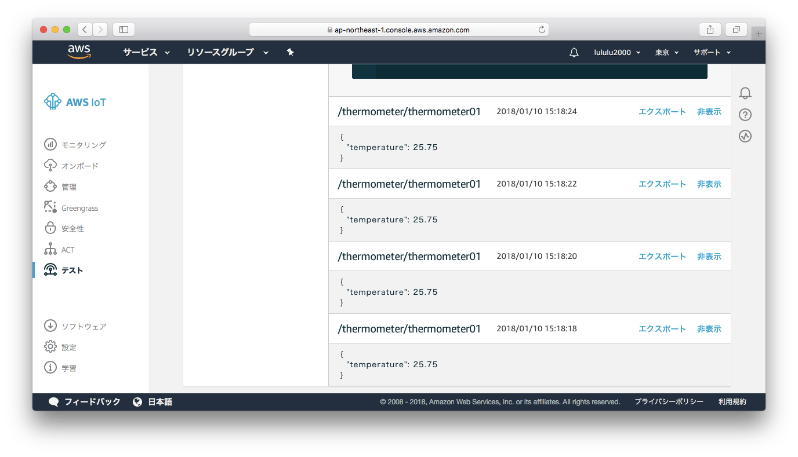

## Elasticsearchサービスの連携
  1. Elasticsearchドメインの作成

    ```
    $ aws es create-elasticsearch-domain \
          --domain-name temperature \
          --elasticsearch-version 6.0 \
          --elasticsearch-cluster-config InstanceType=t2.small.elasticsearch,InstanceCount=1 \
          --ebs-options EBSEnabled=true,VolumeType=standard,VolumeSize=10 \
          --access-policies file://path/to/es-policy.json
    ```
    Elasticsearchドメインの作成は約１０分間かかる。作成されたドメインの状態を確認する：
      ```
      $ aws es describe-elasticsearch-domain \
          --domain-name temperature
      ```
  2. IoTルールの作成

    - IoTサービスにElasticsearchサービスへのアクセスポリシーを作成する。
      ```
      $ aws iam create-policy \
          --policy-name ESAccessForIoT \
          --policy-document file://path/to/esaccess-for-iot.json
      ```
    - ロールを作成
      ```
      $ aws iam create-role \
          --role-name ESAccessForIoTRole \
          --assume-role-policy-document file://path/to/assumeRolePolicyForIoT.json
      ```
    - ポリシーをロールにアタッチ
      ```
      $ aws iam attach-role-policy \
          --role-name ESAccessForIoTRole \
          --policy-arn "arn:aws:iam::011960800664:policy/ESAccessForIoT"
      ```
    - IoTルールの作成
      ```
      $ aws iot create-topic-rule \
          --rule-name temperature \
          --topic-rule-payload file://path/to/rule-temperature.json
      ```
    - 作成されたルールを確認
      ```
      $ aws iot get-topic-rule --rule-name temperature
      ```
  3. ルールの動作確認
    - RaspberryPiから温度データを送信させる。
      ```
      $ python sendTemp.py
      ```
    - Elasticsearchに登録されているデータを確認する。
      ```
      $ curl -XGET 'https://search-temperature-hypugqxmdo3cidfgg6iuinygjm.ap-northeast-1.es.amazonaws.com/thermometer/_search' \
          -d'{"query" : {"match_all" : {}} }' \
          -H 'Content-Type:application/json'
      # 登録されたデータが出力される
      ```

  4. 問題点

  上記登録されたデータの`timestamp`属性はミリ秒のlong型になります。IoTからの登録はdate型に自動変換されなかったようだ。
  とりあえず、下記の手順でIoTからの受信前に、手動でmappingを設定する。
    - 既存のスキーマを削除(まだ受信されていない場合、スキップ)
    ```
    $ curl -H 'Content-Type:application/json' \
        -XDELETE 'https://search-temperature-hypugqxmdo3cidfgg6iuinygjm.ap-northeast-1.es.amazonaws.com/thermometer'
    {"acknowledged":true}
    ```
    - 新規スキーマを作成
    ```
    $ curl -H 'Content-Type:application/json' \
        -XPUT 'https://search-temperature-hypugqxmdo3cidfgg6iuinygjm.ap-northeast-1.es.amazonaws.com/thermometer' \
        -d @json/thermometer-mapping.json
    {"acknowledged":true,"shards_acknowledged":true,"index":"thermometer"}
    ```

## Kibanaで温度データを可視化にする

  1. RaspberryPiで温度データを送信
  ```
  $ python sendTemp.py
  ```
  2. index pattern作成

  AWSコンソールのElasticsearchのtemperatureドメインの概要画面からKibanaのページを開いて、index pattern を作成する画面が表示される。
  index patternに`thermometer`を設定、時間フィルターに`timestamp`属性を指定し、「create」をクリックする。
  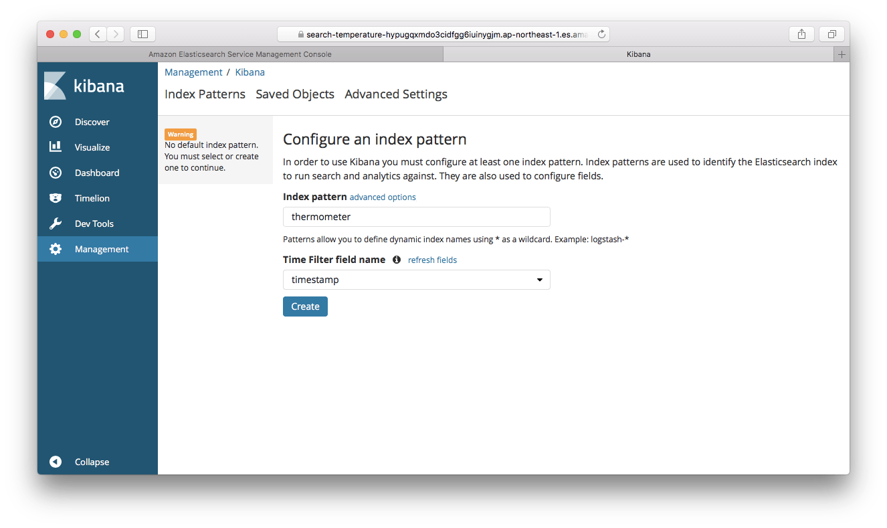

  3. Discover画面でデータを確認する

  左側のメニューから`Discover`をクリックすると、Discover画面が表示される。直前受信した温度データと時間別受信件数のバーチャートが表示される。
  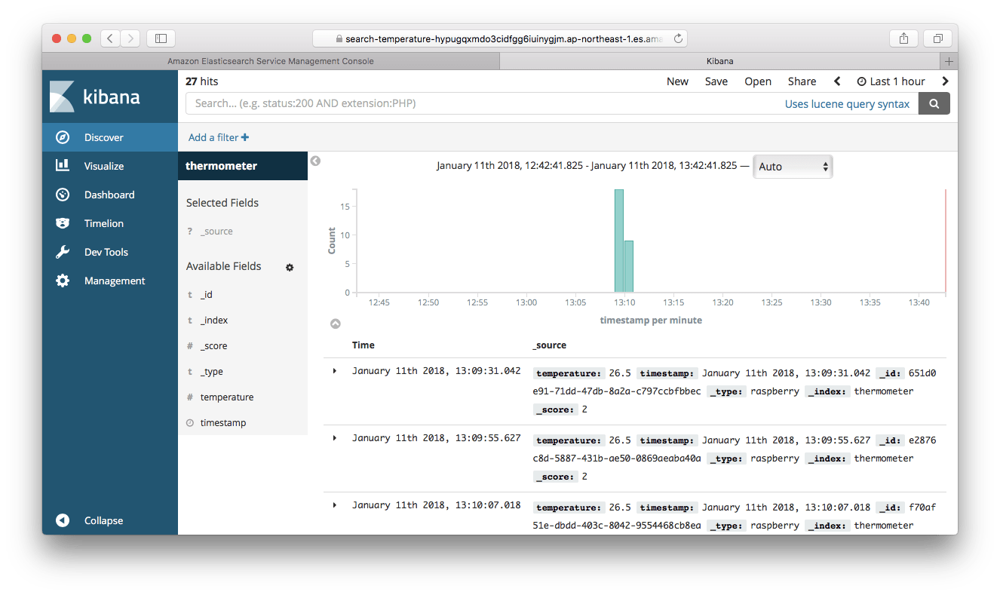

  4. Visualize作成

  左側のメニューから`Visualize`をクリックして、`Create a visualization`をクリックすると、visualizationタイプ選択画面が表示される。
    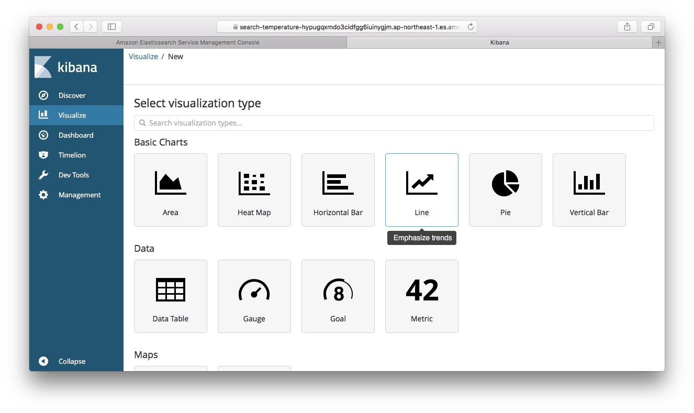

  いずれかのチャートを選択すると、Choose search source画面が表示される。（例はパイチャートを選択した）
    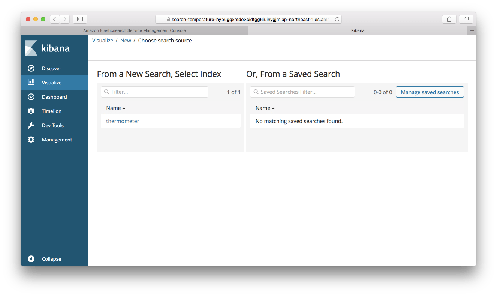

  index `thermometer`を選択すると、visualizeの設定画面が表示される
    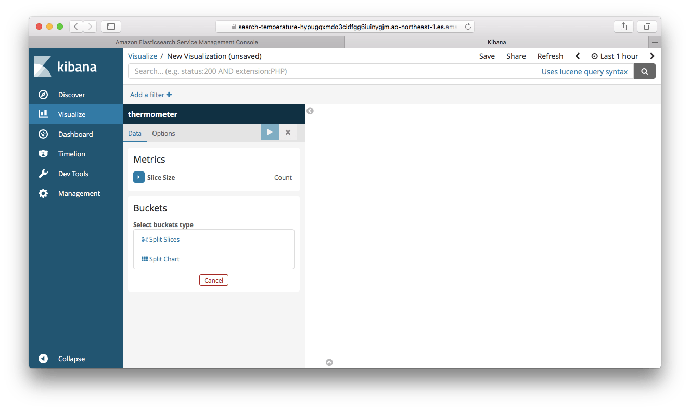

  `Split Slices`をクリックし、`Aggregation`に`Range`を選択して、次の通り温度のRangeを設定し、`Apply changes`をクリックすると、直近１５分間の寒い/やや寒い/適温/やや暑い/暑いの割合が表示される。

  |From|To|
  |---:|---:|
  |0|15.0|
  |15.0|20.0|
  |20.0|26.0|
  |26.0|30.0|
  |30.0|45.0|

  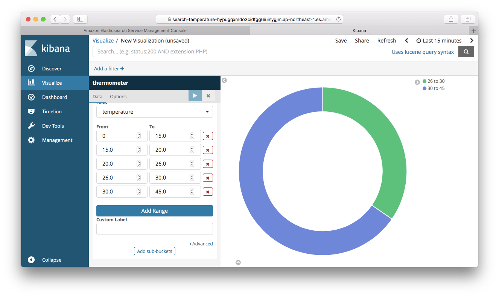

  パイチャートを確認できたら、`Save`をクリックして、名前を付けて保存する。
  再び左側のメニューから`Visualize`を選んで、先ほど保存されたパイチャートが一覧に表示されていることを確認する。
  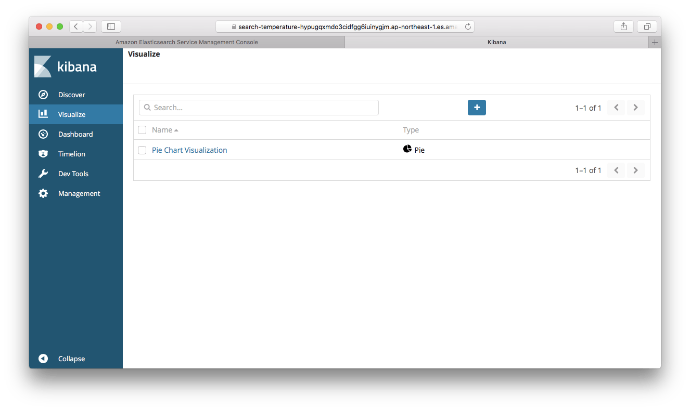

  5. その他Visualizeの確認
    - 縦バーチャート

    1分間隔の最高気温/最低気温図
    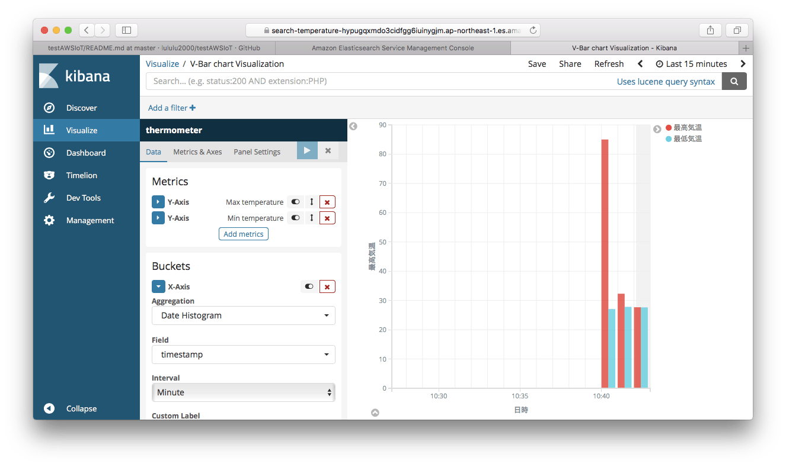

    - データテーブル

    時間ごと最高気温/最低気温/平均気温表
    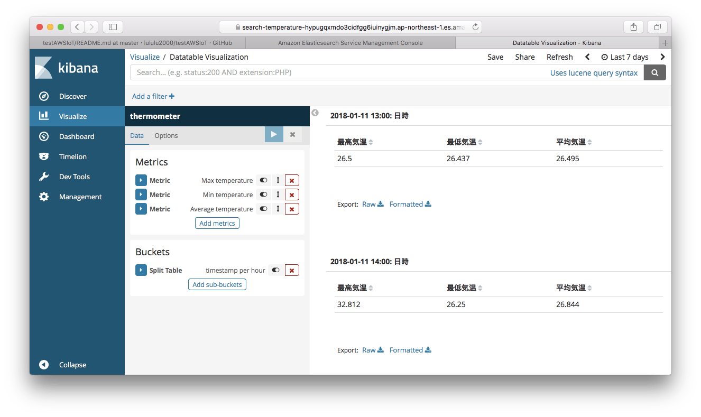

    - ゲージ図

    本日平均気温のゲージ図
    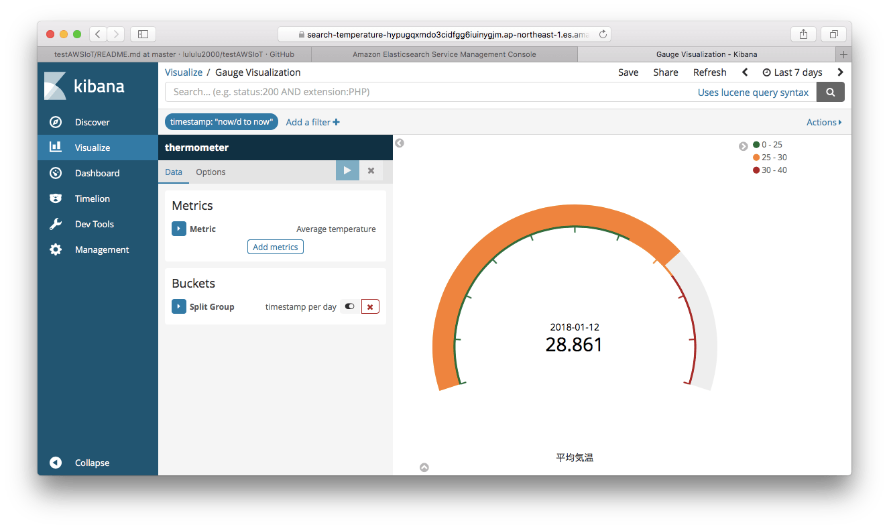

    - 折れ線図

    3時間ごとの最高気温/最低気温/平均気温図
    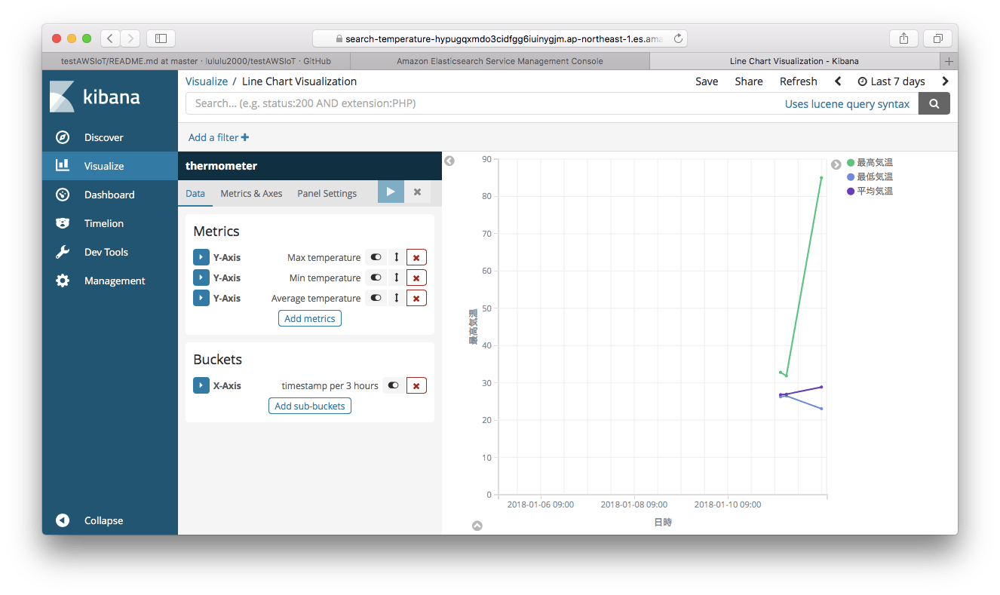
