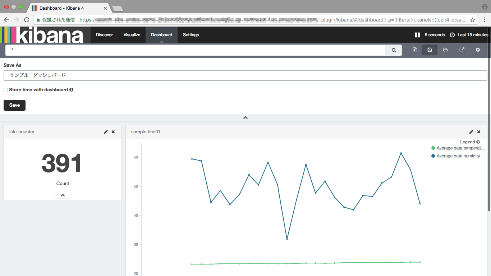

# Andesの利用手順

## 概要

　Andesを利用し、デバイスから送られたデータを蓄積して、
Kibanaで統計図等を含むダッシュボードを作成までの手順を記述する。

## 前提

- サンプルとして使うアカウントは既存の**develop**とする[※](#Comment01)
- Kibanaのバージョンが4とする
- デバイスは[Raspberry Pi 3 Model B]を使う
- デバイスに使われる開発言語はPythonとする

<a name="Comment01">※</a>Andesのアカウント作成手順について、下記文書をご参照ください。
- [Andes WebUI アカウント発行用スクリプト]

## デバイスの登録及び開発用SDKと証明書の取得

### デバイスの登録及び証明書の取得

1. [Andes管理画面]に管理者アカウントでログインする

  

2. 左側のパネルの **デバイス管理** | **デバイス登録** をクリックして、
デバイス登録画面を開き、デバイス名と種別等情報を入力する。

  

3. **登録** をクリックすると、デバイスが登録される

　画面下方表示される証明書一式をダウンロードし、ローカルに保存する。
また、画面に表示されているエンドポイントも控えておく。

  

4. 登録されたデバイスを確認する

　画面左側のパネルの **デバイス管理** | **デバイス一覧/削除/変更** をクリックして、
登録されたデバイスを確認し、表示されたトピックを控えておく

  

### デバイス開発SDKの取得及びインストール

　画面左側のパネルの **SDKダウンロード** | **SDKダウンロード** をクリックして、
SDKダウンロード画面を開く。開発言語を選択し、**GitHubでソースを取得** をクリックして、
開発SDKのページが開かれる。説明を従い、SDKのインストールを行う。


## デバイス側のメッセージ送信準備

### AWS IoT ルート証明書を取得する

        $ curl https://www.symantec.com/content/en/us/enterprise/verisign/roots/VeriSign-Class%203-Public-Primary-Certification-Authority-G5.pem \
                --output root.pem

### 証明書一式をデバイスへ転送

        $ cd path/of/centificates/you/saved \
        && scp certificate.pem.crt \
            private.pem.key \
            root.pem \
            <user>@<Raspberry PiのIPアドレス>:~/path/to/copy

### メッセージ送信用プログラムの配置

    送信プログラムをデバイスへ転送する

        $ cd path/of/this/project/raspberry-pi \
        && scp send_temp.py \
            <user>@<Raspberry PiのIPアドレス>:~/path/to/copy

## Elasticsearch Service側のmapping登録

　送信メッセージに自動識別できない属性があれば、事前にmappingの登録が必要となる。
今回経緯度情報が送信するため、下記のように経度緯度をgeo_pointへマッピングする。
(temperature-develop-mapping.json)

```json
...

"location" : {
    "type" : "geo_point"
},

...
```

　マッピングの登録は、下記コマンドを実行する。

    curl -XPUT "https://<KibanaのURL>/<トピックの2段目>-<トピックの3段目>-<トピックの4段目>" \
        --data @temperature-develop-mapping.json

## デバイスから送信

### 送信プログラム用環境変数を下表の通り設定する

|環境変数名        |設定値                          |
|:---------------|:------------------------------|
|END_POINT       |デバイス登録時控えたエンドポイント   |
|ROOT_CA_PATH    |root.pemのパス                  |
|CERT_PATH       |certificate.pem.crtのパス       |
|PRIVATE_KEY     |private.pem.keyのパス           |
|CLIENT_ID       |任意の値                        |
|TOPIC           |デバイス登録時控えたトピック        |

 例：
  ```sh
  $ export END_POINT="xxxxxxx.iot.ap-northeast-1.amazonaws.com" \
    && export ROOT_CA_PATH="root.pem" \
    && export CERT_PATH="certificate.pem.crt" \
    && export PRIVATE_KEY="private.pem.key" \
    && export CLIENT_ID="test-device" \
    && export TOPIC="andes/temperature/develop/developtemp/n119w82wgdh1"
  ```

### デバイスから送信プログラムを実行し、メッセージを送信する。

    $ cd ~/path/to/copy \
        && python send_temp.py

## Kibanaでデータを可視化する

### Kibanaで受信データを確認

　Kibanaを開いて、**Discover** 画面を開く。
画面左上のIndexにIndex patternを選択して、
時間単位受信数のバーチャートとその明細データが表示される。

Index patternは下記の規則で命名される
```
    <デバイスの種類>-<ユーザーアカウント>-<ユーザーグループ>
```
今回の例の場合、温度デバイスで登録したため、``temperature-develop-developtemp``となる。


### Visualizeを作成

1. **Visualize** 画面を開いて、作りたいVisualizationの種類を選択する。


2. 例として**Line chart**を選択し、Line chartのY軸に温度と湿度の平均値を設定する。


3. X軸を時間にする。


4. **Apply change** ボタンをクリックすると、
時間単位の温湿度Line chartが作成される。


5. Visualizeの保存
**Save Visualization**ボタンをクリックし、
Visualize名を入力して**Save**ボタンを押せば、作成されたLine chartが保存される。


### Dashboardを作成及び共有URLの発行

1. **Dashboard** 画面を開いて、をクリックすると、
Visualizationを選択する画面が表示される。


2. 先ほど作られたVisualizeを選択すると、DashboardにVisualizeが追加される。サイズや位置も調整し、Dashboardを完成させる。


3. 編集が終わったら、**Save Dashboard**をクリックして、
保存名称を入力し、**Save** ボタンをクリックする。



4. **Share**ボタンをクリックすると、ダッシュボードを共有するためのURLが作成される。


上段のスクリプトはHTMLに嵌め込む用iframeのスクリプト、
下段はダッシュボード全体を表示するURLとなる。

[Andes WebUI アカウント発行用スクリプト]:https://github.com/a-ibs/andes/blob/develop/command/account/README.md
[Andes管理画面]:https://andes.aucnet-ibs.com/index.html
[Raspberry Pi 3 Model B]:https://www.raspberrypi.org/products/raspberry-pi-3-model-b/
